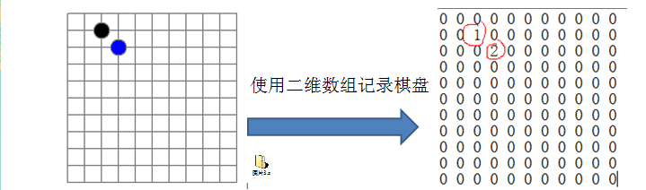
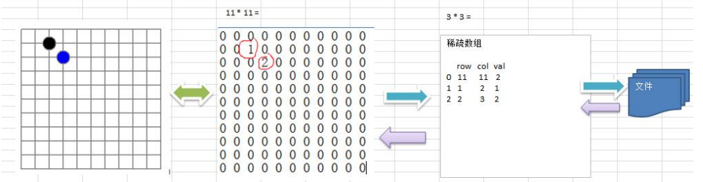

## 先看一个实际需求

* 编写的五子棋程序中，有**存盘退出**和续上盘的功能。



* 分析问题：

  因为该二维数组的很多值是默认为0，因此记录了**很多没有意义的数据 -> 稀疏数组**

## 基本介绍

​	当一个数组中大部分元素为0，或者为同一个值得数组时，可以使用稀疏数组来保存该数组。

* 稀疏数组的处理方法：
  1. 把具有不同值得元素的行列及值记录在一个小规模的数组中，从而**缩小程序**的规模。
  2. 稀疏数组一共有3列：行、列、值；
  3. 第一行表示：总共几行、总共几列、不同的数组个数；
  4. 从第二行表示具体的值在几行几列，以及具体的值；

## 应用实例

1. 使用稀疏数组，来保留类似前面的二维数组（棋盘、地图等）

2. 把稀疏数组存盘，并且可以从新恢复原来的二维数组值

3. 整体思路分析



* 二维数组 转 稀疏数组 ：
  1. 便利原来的二维数组，得到有效的个数sum。
  2. 根据sum就可以创建 稀疏数组 sparseArr = new int[sum+1] [3]。
  3. 将二维数组的有效数据存入到 稀疏数组。

* 稀疏数组 转 二维数组：
  1. 先读取稀疏数组第一行，根据第一行的数据，创建原始的二维数组，比如：chessArr = int[11] [11]
  2. 在读取稀疏数组后几行，并赋给原始的二维数组即可。


## 代码实现

```java
package com.luliang.sparsearray;

public class SparseArray {
    public static void main(String[] args) {
        // 1. 创建一个原始的二维数组 11*11
        // 0：表示没有棋子 1：黑子 2：白子
        int[][] chessArr1 = new int[11][11];
        chessArr1[1][2] = 1;
        chessArr1[2][3] = 2;
        chessArr1[4][5] = 2;

        //输出原始的二维数组
        System.out.println("原始数组：");
        for (int[] row : chessArr1) {
            for (int data : row) {
                System.out.printf("%d\t", data);
            }
            System.out.println();
        }
        //将二维数组转稀疏数组
        //1. 先便利二维数组，得到非0数据的个数
        int sum = 0;
        for (int i = 0 ; i < 11 ; i++) {
            for (int j = 0; j < 11; j++) {
                if (chessArr1[i][j] != 0) {
                    sum ++ ;
                }
            }
        }

        //2. 创建对应的稀疏数组
        int spaeseArr[][] = new int[sum + 1][3];
        //给稀疏数组赋值
        spaeseArr[0][0] = 11;
        spaeseArr[0][1] = 11;
        spaeseArr[0][2] = sum;
        //便利二维数组，将非零的值放入稀疏数组
        int count = 0;  //count 用于记录第几个非0数据
        for (int i = 0; i < 11; i++) {
            for (int j = 0; j < 11; j++) {
                if (chessArr1[i][j] !=0) {
                    count ++;
                    spaeseArr[count][0] = i;
                    spaeseArr[count][1] = j;
                    spaeseArr[count][2] = chessArr1[i][j];
                }
            }
        }

        //输出稀疏数组
        System.out.println("得到的稀疏数组为：");
        for (int i = 0; i < spaeseArr.length; i++) {
            System.out.printf("%d\t%d\t%d\t\n", spaeseArr[i][0], spaeseArr[i][1], spaeseArr[i][2]);
        }

        //3. 将稀疏数组恢复成二维数组
        //读取稀疏数组第一行，根据行列创建原始二维数组
        int[][] chessArr2 = new int[spaeseArr[0][1]][spaeseArr[0][1]];
        //从第二行读取稀疏数组，并赋给原始二维数组
        for (int i = 1; i < spaeseArr.length; i++) {
            chessArr2[spaeseArr[i][0]][spaeseArr[i][1]] = spaeseArr[i][2];
        }
        //输出恢复后的二维数组
        System.out.println("输出恢复后的二维数组：");
        for (int[] row : chessArr2) {
            for (int data : row) {
                System.out.printf("%d\t", data);
            }
            System.out.println();
        }
    }

}
```

## 课后练习

1. 在前面的基础上，将稀疏数组保存到磁盘上，比如：map.data
2. 恢复原来的数组时，读取map.data进行恢复